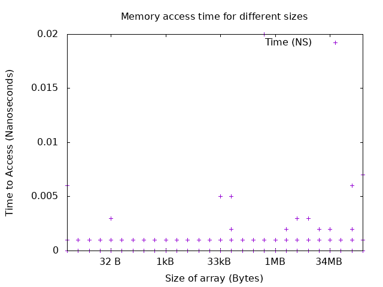

# HW 9: Memory Coding Communtication (Evaluation Assignment)

This assignment has....

Only two files are used across both questions:

 * `README.md`
 	 * The file for documentation and writeup
 * `Makefile`
	 * File for building

Completion of files are denoted with checkmark boxes (-[x]) 

## Question 1: Benchmarking the Memory Hierarchy 

This question asks for a look into the memory hierarchy. 

There are several associated files:

 * [x] `Benchmark.C`
	 * File that contains relevant code for question.
 * [x] `Benchmark.hh`
	 * Header file.
 * [x] `output.csv`
 	 * Data from a run of the most recent `Benchmark.C` on my computer. Details on computer specifics are below. 
 * [x] `plot.gnuplot` 
	 * Charts the data.
 * [x] `plot.png`
	 * Chart generated from `plot.gnuplot`.

### Testing

To test, run `make run_benchmark` this will build `Benchmark` then create a file that times a list up to 1 gb by powers of 2 and makes 10,000 accesses to the memory. It then generates a plot using gnuplot.

### Analysis

This is a difficult assignment to avoid adding additional overhead to the timing. Some solutions I have heard have been to use a for loop (this creates additional micro instructions), unroll a for loop. I opted unroll a for loop into four calls and divide the time by four. 

*The resulting graph is chaotic and as of this commit is a point plot without fancy tricks. I have attempted to make it a boxplot or a graph with the x axis jittered to to no available.* 

[My computer](https://en.wikipedia.org/wiki/Surface_Book_3) has the following memory hierarchy:
Location | Type | Size
---------|------|------
CPU | L1 Cache | 320 KB
CPU | L2 Cache | 2.0 MB
CPU | L3 Cache | 8.0 MB
RAM | RAM | 32 GB
Disk | SSD | 512 GB 
GPU | vRAM | 6 GB

What I can say from this graph is there are a handful of outliers before 33 KB that continues to 128 kB. I would guess that at this stage it was still utulizing L1 cache as it had consistent fast results with the majority of points being negligible to time. 

From 512 kB to 2 MB (with the exception of 1 MB) there is a similar spread for the hits. 

After 2 MB there is no clear deliniation without becoming a [Texas Sharpshooter](https://en.wikipedia.org/wiki/Texas_sharpshooter_fallacy). There is a larger miss penalty at these figures. 

It's a little difficult to see because of the scaling, but once the computer is attempting to access from a gigabyte large array it has longer misses. 

Digging through the CSV, what is not reflected in this graph are the number of points where there exists overlap. In the lower ranges the time is closer to negligible. 

## Question 2: Comparing Barriers

This question uses code distributed in class

The files for this problem are:

- [ ] `dissemination.cc` `dissemination.hh`
	* Contains code for this 
- [ ] `centralized.cc` `centralized.hh`
	* Contains code for...
- [ ] `mcs.cc` `mcs.hh`
	* Contains code for the MCS barrier...
- [ ] `barrier_testing.cc` `barrier_testing.hh`
	* This file takes the previous three files and links them so...
- [ ] `barrier_performance.cc` `barrier_performance`
	* These files test the performance of barriers

### Implementation

The implementation is mostly outlined above...

### Correctness Testing 

Correctness testing is performed in `barrier_testing.cc` and can be run with `make run_barrier_correctness`

### Performance Testing

Performance testing can be run with `make run_barrier_performance`

### Analysis
 

