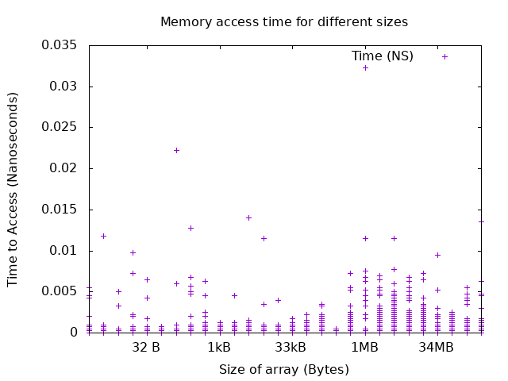

# HW 9: Memory Coding Communtication (Evaluation Assignment)

## Question 1: Benchmarking the hierarchy 

This file

### Testing

To test, run `make run_benchmark` this will build `Benchmark` then create a file that times a list up to the size of 1024 mb. It then plots in gnuplot 

## Analysis

This is a difficult assignment to avoid adding additional overhead to the timing. Some solutions I have heard have been to use a for loop(this creates additional micro instructions), unroll a for loop. I opted 

